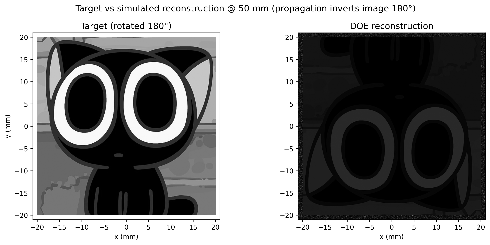

# DOE 相位设计：50 mm 自由空间再现目标图像

纯相位 DOE（衍射光学元件）设计：高斯光束入射 1.5 mm × 1.5 mm 相位片，
自由空间传播 50 mm 后在 40 mm × 40 mm 区域再现目标灰度图像（罗小黑）。
设计算法为信号窗口约束 IFTA（Gerchberg–Saxton 改进型 + MRAF 混合）。

## 系统参数

| 项目 | 参数 |
| --- | --- |
| 波长 λ | 1.064 µm |
| DOE | 1.5×1.5 mm，1536×1536 像素（0.98 µm/px），纯相位 |
| 入射光 | 基模高斯光束，1/e² 半径 w₀ = 0.75 mm（DOE 半径 = w₀） |
| 传播 | 自由空间 Fresnel 衍射，z = 50 mm |
| 目标图像 | 40×40 mm 灰度图（信号窗口 1128×1128 px） |

## 采样与衍射几何校验

| 校验项 | 结果 |
| --- | --- |
| 输出面采样 | dx₂ = λz/L₁ = 35.47 µm |
| 图像边缘衍射角 | atan(20/50) = 21.8° |
| Nyquist 允许最大坐标 | λz/(2·dx₁) = 27.2 mm > 20 mm ✓ 无混叠 |
| 最细局部光栅周期 | ≈ 2.9 µm ≈ 3 像素（可制造性见下） |
| 近轴近似误差 | 22° 处约 2%（1−cosθ 量级），可接受 |

## 设计算法

**信号窗口 IFTA + MRAF**：40×40 mm 信号窗口（SW）内施加目标振幅约束，
窗外为自由区（吸收残差、提升窗内保真度）；每轮迭代将目标振幅按
窗内能量归一，并以 MRAF 方式混合（m = 0.8）抑制散斑：

```
像面:   U = FFT{ E·exp[iπ(x²+y²)/(λz)] }      （DOE → 像面 Fresnel）
约束:   U′_SW = [m·s·A_t + (1−m)|U|]·e^{i∠U},  s = √(E_SW/ΣA_t²)
        U′_窗外 = U（自由）
DOE 面: E ← A_Gauss·e^{i∠E′}                   （振幅重置为高斯, 保留相位）
```

3 组随机初始相位 × 120 次迭代，取 RMSE 最优。

> **关键经验**：目标振幅 A_t 是 0–1 的图像尺度，而光场振幅在 ~10³
> 量级——必须按窗内能量归一到同一尺度（上式的 s），否则约束会把
> 能量"压出"信号窗口，迭代退化为窗外散斑（实测效率会从 43% 跌到 0.1%）。

## 结果

| 指标 | 连续相位 | 256 级量化 (8 bit) |
| --- | --- | --- |
| 重建 RMSE（最优增益） | 0.0014 | 0.0040 |
| 衍射效率 η（窗内能量占比） | 42.7% | 42.7% |

- 收敛曲线：RMSE 0.41 → 0.0014（120 次迭代），见 `figures/doe/doe_convergence.png`
- 重建像相对目标旋转 180°（傅里叶传播固有性质；预旋转目标即可得正立像）
- 256 级量化性能几乎不变，兼容 SLM 与多台阶光刻



## 文件结构

```
code/
  doe_design.py            DOE 相位设计主程序 (IFTA+MRAF, complex64 加速)
  gen_html_report_doe.py   自包含 HTML 设计报告生成器
figures/doe/               目标图 / DOE 相位图 / 重建像 / 对比 / 收敛曲线
reports/                   自包含 HTML 设计报告（双击离线查看）
data/doe_phase_data.npz    DOE 相位数据（连续 + 256 级量化两版,
                           1536×1536, 0.98 µm/px, 可直接用于加工或 SLM）
```

## 运行方法

Python 3.x + numpy + matplotlib + Pillow：

```bash
python code/doe_design.py            # 设计 + 仿真 + 出图 + 指标 (~8 min)
python code/gen_html_report_doe.py   # 生成 HTML 报告
```

脚本顶部的参数区可改：波长、DOE 尺寸/采样、工作距离、目标尺寸、
高斯腰半径、目标图片路径、迭代/重启次数。

## 假设与注意事项

- 波长与几何绑定：DOE 相位深度 ∝ 1/λ，更换波长需重新设计。
- 高斯腰半径 w₀ = 0.75 mm 为设定值，可按实际光束修改。
- 最细局部周期 ≈ 2.9 µm，电子束/激光直写可制造；若放宽到 2 µm 像素，
  需等比例放大工作距离或图像尺寸以保持衍射几何。
